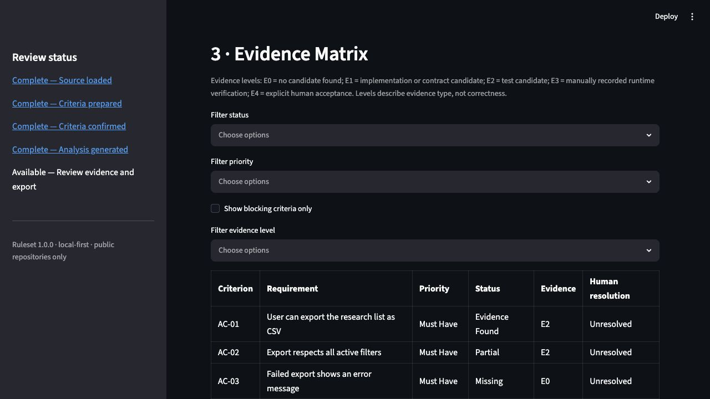

# ScopeProof

**See which acceptance criteria have credible PR evidence—and which still need review.**

ScopeProof is a reviewer-controlled acceptance-coverage assistant for public GitHub pull requests.
It maps each confirmed criterion to inspectable implementation or test candidates, makes missing
evidence visible, records attributable human decisions, and exports a reproducible review. The
primary workflow is designed to reach an inspectable coverage report in under five minutes.

ScopeProof is an evidence assistant. It does not replace QA, engineering review, runtime testing, or human acceptance.



*Controlled demo screenshot—not a customer case. It shows deterministic candidate evidence and
missing-evidence states; it is not runtime verification or proof of correctness. See the
[deliberately constructed demo](#deliberately-constructed-demo) for the expected findings.*

## Why this exists

AI coding agents can produce pull requests quickly, but a green CI check does not establish that every ticket promise was implemented. Product reviewers still need to answer questions such as:

- Did export include every active filter?
- Is the failure state visible to the user?
- Was the required analytics event added?
- Does a test exercise the requested behavior, or does a similarly named test merely exist?
- Did the pull request expand scope beyond the approved requirement?

ScopeProof turns that review into a requirement-to-evidence matrix. It shows why each candidate matched and what remains unverified.

## MVP boundaries

- The repository is published under an [evaluation-only use policy](USE_POLICY.md) and does not
  grant an open-source license.
- No paid LLM API and no model-generated verdicts.
- Supports public repositories only.
- Anonymous GitHub access works without a token.
- An optional GitHub token can increase free rate limits; it remains in Streamlit session memory and is never exported or saved.
- Users author and confirm criteria. ScopeProof does not invent product requirements.
- Pull-request code is never executed.
- Static candidates cannot be presented as runtime verification.
- General bug review, security scanning, automatic fixes, private repositories, Jira, billing, and team accounts are outside this release.

## Evidence and review language

| Level | Meaning in this MVP |
|---|---|
| E0 | No candidate evidence found |
| E1 | Candidate implementation or contract evidence |
| E2 | Candidate test evidence that still requires reviewer confirmation |
| E3 | Runtime verification recorded manually from an external check |
| E4 | Explicit human acceptance |

The workbench describes criterion evidence as **Strong candidate**, **Weak candidate**, **No
candidate**, **Analysis incomplete**, **Reviewer verified**, or **Rejected**. Candidate strength is
not correctness. Implementation, test, runtime, documentation, and contract evidence remain
separate types.

The release gate uses explicit precedence:

1. **Action required** for failed checks, change-required decisions, or unresolved must-have gaps.
2. **Review incomplete** for unconfirmed criteria, partial ingestion, unavailable checks,
   ambiguous evidence, or unresolved decisions.
3. **Accepted with exceptions** for explicitly accepted exceptions.
4. **Review complete** only after complete ingestion, passing observed CI, current decisions for
   every criterion, and final human acceptance.

GitHub exposes visible check runs but does not reliably expose every repository's required-check
policy to anonymous clients. ScopeProof therefore labels this value **Observed CI state** and counts
only explicit success as passing.

## Quickstart

Python 3.11 or newer is required.

Install the verified v0.2.0 release wheel in an isolated environment. This path does not require
cloning the repository.

```bash
python3 -m venv .venv
source .venv/bin/activate
python -m pip install \
  https://github.com/YuzeJ21/Scope-Proof/releases/download/v0.2.0/scopeproof-0.2.0-py3-none-any.whl
scopeproof benchmark
scopeproof-web --host 127.0.0.1 --port 8501
```

To verify the release bytes before installation, download the wheel and its checksum:

```bash
curl -LO https://github.com/YuzeJ21/Scope-Proof/releases/download/v0.2.0/scopeproof-0.2.0-py3-none-any.whl
curl -LO https://github.com/YuzeJ21/Scope-Proof/releases/download/v0.2.0/scopeproof-0.2.0-py3-none-any.whl.sha256
```

Use the command for your platform, then install the verified local file:

```bash
# macOS
shasum -a 256 -c scopeproof-0.2.0-py3-none-any.whl.sha256

# Linux
sha256sum -c scopeproof-0.2.0-py3-none-any.whl.sha256

python -m pip install ./scopeproof-0.2.0-py3-none-any.whl
```

A matching checksum verifies the downloaded bytes against the digest published with this release.
It does not provide code-signing or product-correctness assurance.

The offline benchmark verifies that the installed package and bundled regression corpus execute.
It is not runtime evidence for any pull request. `scopeproof-web` starts the packaged local
workbench; stop it with `Ctrl+C`. Continue with the public-PR CLI workflow below to review
reviewer-confirmed criteria against a real public PR.

### Public PR CLI workflow

After installation, the CLI provides the same read-only public-PR ingestion and deterministic
core without starting Streamlit. First create `requirements.txt` with one atomic criterion per
line. Every line must contain reviewer-confirmed criteria; running the command is an explicit
confirmation that this normalized set is ready for analysis.

```bash
scopeproof review --pr https://github.com/OWNER/REPOSITORY/pull/123 \
  --requirements requirements.txt \
  --storage-dir .scopeproof/reviews \
  --report scopeproof-review.md
```

The optional report path may end in `.md`, `.json`, `.csv`, or `.html`. ScopeProof validates the
selected export and refuses to overwrite an existing file.

The command prints JSON containing the local `review_id`, record path, head SHA, and provisional
gate verdict, plus the requested report path. Use the review identifier later to repeat the export
or choose another format:

```bash
scopeproof export REVIEW_ID \
  --storage-dir .scopeproof/reviews \
  --format markdown
```

Available repeat-export formats are `json`, `markdown`, `csv`, and `html`.

CSV exports neutralize leading spreadsheet-formula characters in scalar text cells. Fields that
can contain multiple values (`ingestion_warnings`, `skipped_files`, `evidence_links`,
`missing_evidence`, `runtime_artifacts`, and `runtime_result`) are JSON arrays inside their CSV
cells so delimiters in repository or reviewer text do not destroy provenance.

Anonymous public-repository access is the default. `--token` is optional and can increase GitHub's
free rate limit, but it is not required or persisted. The CLI never comments on the pull request,
executes its code, or converts static candidates into runtime verification.

## Contributor setup

For a fully pinned setup, use the [reproducible development environment](docs/development-environment.md). The standard editable setup remains available below.

Read the [evaluation-only use policy](USE_POLICY.md) before cloning or proposing a contribution.
Public visibility does not grant permission beyond evaluation and review.

Clone the repository to run the Streamlit workbench or contribute changes:

```bash
python3 -m venv .venv
source .venv/bin/activate
python -m pip install -e '.[dev]'
streamlit run apps/web/app.py
```

Open the displayed local URL, then choose either path:

1. Select **Load deliberately constructed demo** for a complete offline walkthrough.
2. Enter a public GitHub PR URL, fetch it, paste one criterion per line, and confirm the criteria.
   Session-only tokens and bounded unchanged candidate paths are under **Advanced source options**.

The five review steps are:

1. Start Review.
2. Confirm Criteria.
3. Evidence Matrix.
4. Criterion Detail, external verification, and human resolution.
5. Summary and Markdown, JSON, or CSV export.

### Durable local review workflow

The workbench keeps criteria revisions and append-only resolution history. Adding, removing,
splitting, reordering, or editing criteria invalidates the previous analysis and requires explicit
reconfirmation before another review run. Human decisions and final acceptance are recorded as
history rather than silently replacing earlier decisions.

### Local review storage

The workbench stores versioned JSON records under `~/.scopeproof/reviews`. The reopen panel lists
safe local record IDs in deterministic order, while an empty store retains manual ID recovery.
The app validates the selected record when it is opened and refuses a configured review path that
is a symbolic link or another existing non-directory. This app-owned local directory prevents a
browser input from selecting arbitrary file paths. Records preserve the review SHAs, criteria
revisions, evidence, findings, resolution history, and gate decision. They never contain the
optional GitHub token. A reopened review reports a changed head SHA rather than silently reusing
old evidence. After a new analysis, the workbench compares previous and current heads, candidates,
finding states, reviewer decisions, and review status without mutating either bundle. Candidate
evidence is classified as **Unchanged**, **Relocated**, **Modified**, **Added**, or **Removed**.
Changed candidates show both the previous and current immutable location and excerpt so the
reviewer can inspect what moved or changed before recording a new decision. This comparison does
not prove criterion satisfaction.

From the CLI, run `scopeproof list` to return the safe local review IDs in the default
`.scopeproof/reviews` directory; add `--storage-dir PATH` only when earlier CLI commands used that
same alternative directory. The command lists identifiers in deterministic order and does not parse review contents.
This local inventory is not review, test, runtime, or correctness evidence.

To delete one saved review in the workbench, select its listed ID, then check
`Permanently delete the selected local review`. From the CLI, run
`scopeproof delete REVIEW_ID`; add `--storage-dir PATH` only for a review saved
outside the default CLI directory. Deletion removes only that app-owned JSON
record. Exported reports remain user-owned and are not removed, and deletion is
not secure erasure of storage media or backups. An open deleted review remains
available as unsaved session work until it is replaced or the session ends.

## Deliberately constructed demo

The bundled CSV export case is a deliberately constructed demo, not a real incident. Its PR-shaped fixture implements CSV export, one active filter, and a happy-path test. It intentionally omits another filter, the error state, and the `research_exported` event.

Expected output:

| Criterion | Expected finding |
|---|---|
| AC-01 Export CSV | Strong candidate |
| AC-02 Respect all active filters | Weak candidate |
| AC-03 Show export failure | No candidate |
| AC-04 Record `research_exported` | No candidate |

The review status is **Action required** because must-have gaps remain.

## Verification

Run lint and all offline tests:

```bash
python -m ruff check .
python -m pytest -q
```

Run the labeled regression benchmark:

```bash
uv run scopeproof benchmark
uv run scopeproof comparison-benchmark
```

The first command executes 12 executable benchmark cases for acceptance coverage, rather than
treating a static category list as coverage. The equivalent module entry point is
`python -m scopeproof_core.evals.runner`. It reports executed case and criterion counts, False Ready, False Blocker,
case-level mismatches, immutable evidence-link errors, and unexecuted required categories. It exits
nonzero when a known must-have False Ready, label mismatch, evidence-link error, or unexecuted
category is present.

The second command executes a paired previous/current review case and checks deterministic
re-review classification, including conservative handling of ambiguous duplicate candidates. The
paired case is deliberately constructed engineering evidence. It does not advance Stage 1. This
engineering evidence does not prove correctness, does not constitute customer validation, and
does not show external use.
Both benchmark commands execute local JSON inputs only; they do not run fixture repository code.

Run the opt-in live public GitHub smoke test:

```bash
RUN_LIVE_GITHUB_TESTS=1 python -m pytest tests/github/test_live_public_pr.py -q
```

Check the running Streamlit server:

```bash
curl --fail http://127.0.0.1:8501/_stcore/health
```

## Architecture

```text
Public GitHub PR
      ↓
Read-only ingestion
      ↓
User-confirmed criteria
      ↓
Deterministic candidate retrieval
      ↓
Provisional findings + human resolution
      ↓
Deterministic gate
      ↓
Markdown / JSON / CSV / HTML
```

`scopeproof_core` contains Pydantic contracts, ingestion, retrieval, verification, gates, reporting, fixtures, and evaluation. It has no Streamlit dependency. `apps/web/app.py` is a thin local interface over those core services.

Every evidence item contains a file, line, immutable head SHA, GitHub permalink, excerpt, matching rule, relevance reason, deterministic score, and limitations. Deleted lines cannot become current implementation evidence. Partial ingestion cannot produce Ready.

GitHub file and commit ingestion follows pagination and has explicit file, patch, and total-diff
limits. ScopeProof can also inspect a bounded unchanged candidate file when a caller explicitly
justifies it. This evidence is labeled `unchanged_candidate`, anchored to the head SHA, and never
means that the repository was scanned broadly.

## Repository layout

```text
apps/web/                 Streamlit review workbench
scopeproof_core/github/   Public GitHub ingestion
scopeproof_core/criteria/ Manual criterion preparation
scopeproof_core/retrieval/Deterministic evidence candidates
scopeproof_core/verification/Provisional findings
scopeproof_core/gates/    Release truth table
scopeproof_core/reporting/Markdown, JSON, CSV, and HTML exports
scopeproof_core/evals/    Regression runner
evals/                    Controlled fixtures and labels
tests/                    Unit, regression, AppTest, and live smoke tests
```

## Privacy and trust

The application does not persist credentials or execute repository code. Review exports contain the repository, PR number, head SHA, ruleset version, criteria, evidence, findings, resolutions, and gate reasons. They do not contain the optional GitHub token.

Large or truncated diffs are labeled partial and force human review. Missing GitHub checks are represented as unavailable, never passing. A parser or retrieval failure must fail safely rather than produce Ready.

The [privacy-readiness design](docs/privacy-readiness.md) documents current
local-only retention, deletion responsibility, fork protection, and the future
read-only private-repository boundary. It does not claim private support exists.

## Product status

This is a public-repository alpha for validating the requirement-to-evidence workflow. The next
product decision must be based on repeat use with real pull requests and confirmed gaps found
before merge—not release activity or vanity metrics.

The [public roadmap](ROADMAP.md) defines the evidence-gated path from engineering-complete public
alpha to limited beta. The [changelog](CHANGELOG.md) summarizes the active development line and
links to authoritative published release notes. Neither document substitutes for genuine public-PR
use or human acceptance.

Standard reviews create no research record. To volunteer genuine feedback, explicitly enable the
**Alpha feedback session** and follow the [public-alpha participant quickstart](docs/alpha/participant-quickstart.md).
Qualification and consent stay local and off by
default; the constructed demo never counts as participant validation.

ScopeProof is an acceptance-coverage assistant, not an AI code reviewer. The optional
**free design-partner review** is public-repository-only. No paid product or billing is active, and
a pricing question is optional research after product use—not a purchase requirement. The
[30-day commercial-validation guide](docs/commercialization/design-partner-sprint.md) defines the
inbound workflow, evidence gates, stop rules, and capabilities that remain deferred.

The [launch evidence matrix](docs/launch/evidence-matrix.md) and
[review-before-posting LinkedIn draft](docs/launch/linkedin-draft.md) keep the
constructed-demo and technical-smoke boundaries explicit.

## GitHub Action advanced preview

The default product is the local workbench. The checked-in [GitHub Actions
guide](docs/github-action.md) covers an advanced, non-blocking preview for repositories that make a
separate operator decision to adopt it. It requires checked-in, hash-confirmed requirements and
never checks out or executes pull-request head code. It is not part of first use and does not
replace the reviewer-controlled workflow.

## Explicit local Definition-of-Done packs

`scopeproof_core.rule_packs` offers opt-in local prompts for error, loading,
empty, analytics, authorization, API documentation, and migration coverage.
They are never inferred or added to a review automatically. Each is labelled
`Implicit local rule` and has an `implicit_rule_pack` source so it cannot
masquerade as a user-confirmed source requirement; a reviewer must explicitly
include and confirm it before analysis.

## Evidence-quality metrics

`scopeproof benchmark` emits `evidence_quality_metrics` alongside its executed
fixture results: immutable evidence-link precision, incorrect-line-citation
rate, criterion agreement, and False Ready/False Blocker totals. These measure
only the checked-in, executed labels; they do not prove runtime correctness or
market validation. Human override, accepted-exception, and unresolved-ambiguity
rates are intentionally `null` unless calculated from selected persisted review
histories.
