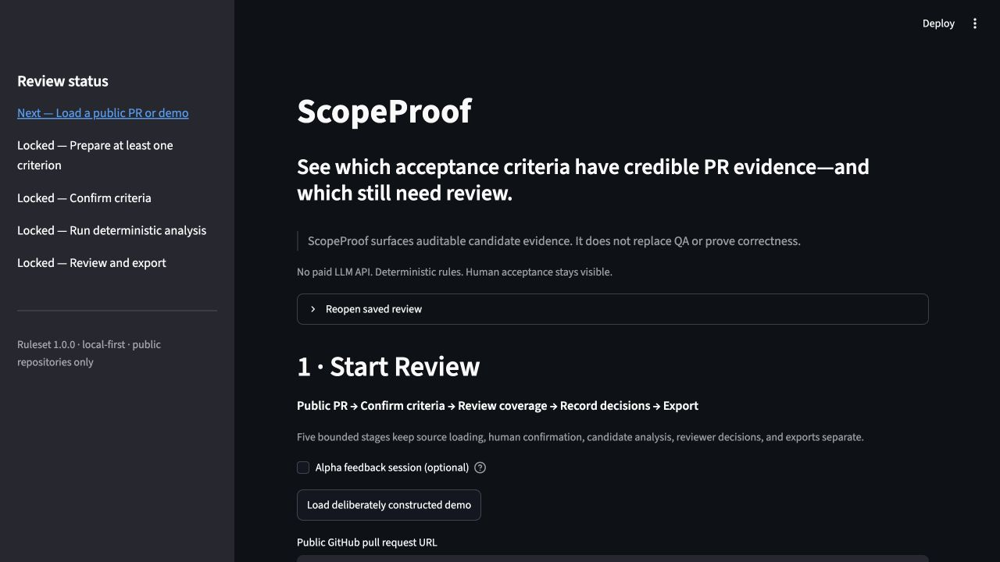
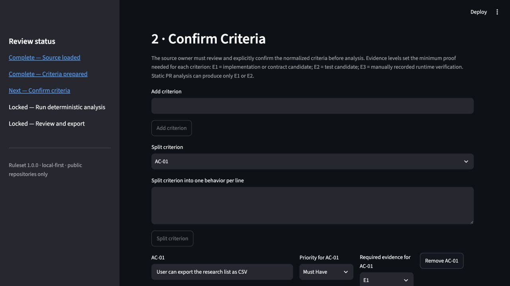
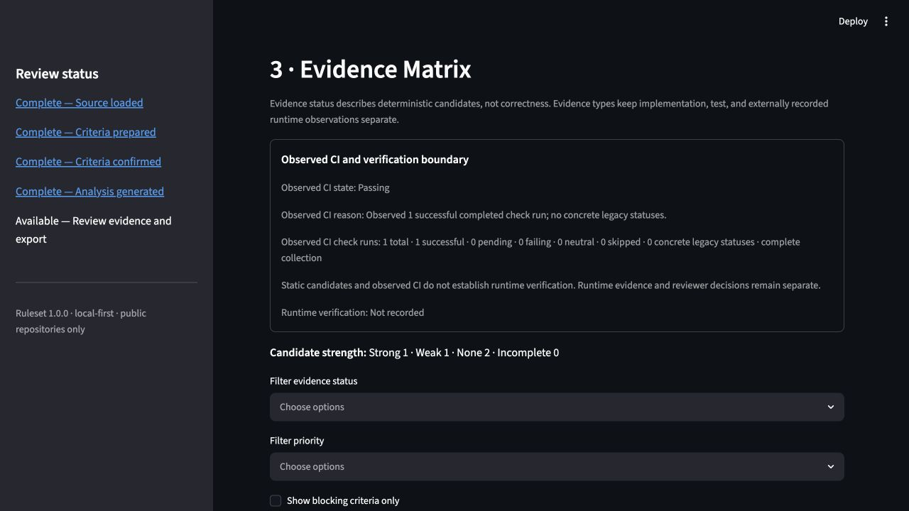
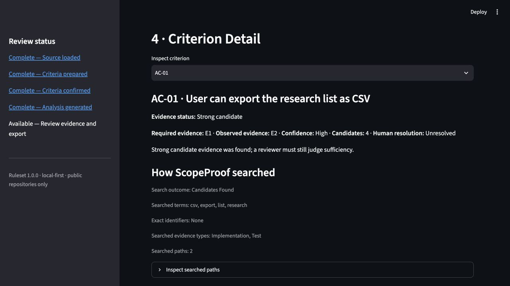
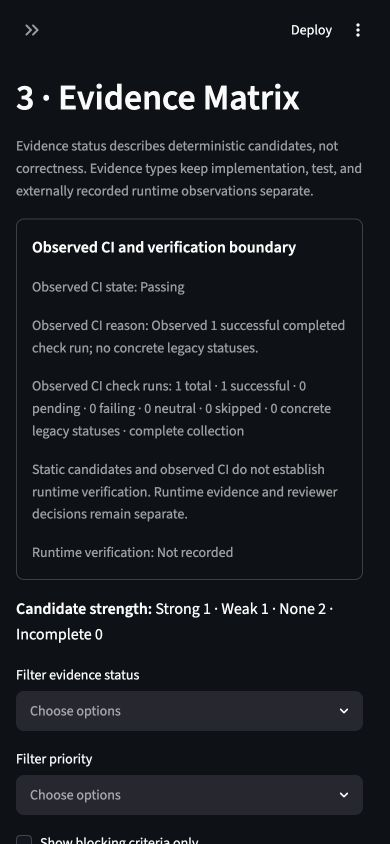

# v0.2.3 Workbench Accessibility and First-Use Audit

Status: internal engineering audit  
Date: 2026-07-26  
Environment: macOS, Streamlit local server, in-app Chromium browser  
Boundary: this is an owner-operated engineering rehearsal. It is not a
participant usability study, customer validation, or a WCAG conformance claim.

## Outcome

The primary review path remains understandable and usable with pointer input at
desktop and narrow widths. The v0.2.3 retrieval diagnostics, candidate-strength
summary, and unresolved-criteria queue make the next reviewer action clearer
without changing the deterministic gate.

The audit found one actionable accessibility risk: the inspected combobox did
not expose a clearly visible focus outline in the browser harness. The
candidate now adds an explicit high-contrast `:focus-visible` treatment and a
source-level regression check. Keyboard activation of the
criteria-confirmation and analysis buttons could not be confirmed with the
harness. A packaged keyboard and assistive-technology pass remains required
before any accessibility-readiness claim.

## Numbered first-use walkthrough

1. Start a review from a deliberately constructed local demo or a public PR.
   The page states the product boundary and shows the five review stages.

   

2. Review and explicitly confirm normalized criteria. Evidence levels are
   explained before analysis, and static analysis remains limited to E1 or E2.

   

3. Inspect the evidence matrix. Candidate strength and observed CI are shown
   separately from runtime verification and human decisions. The unresolved
   queue recommends the next action for each criterion.

   

4. Open a criterion to inspect candidate lines and retrieval diagnostics.
   Search diagnostics are explicitly described as explanations, not proof that
   a criterion is satisfied or absent.

   

5. At a 390 x 844 viewport, the evidence matrix reflowed to one column without
   observed horizontal overflow or hidden evidence-card fields.

   

## Accessibility evidence matrix

| Check | Result | Evidence and limit |
| --- | --- | --- |
| Semantic structure | Partial pass | Browser accessibility snapshot exposed ordered headings, links, labelled textboxes, comboboxes, checkboxes, buttons, status regions, and alerts. No screen reader was run. |
| Labels and names | Partial pass | Primary review inputs and actions had accessible names in the browser snapshot. This does not prove useful announcements in VoiceOver, NVDA, or JAWS. |
| Keyboard-only flow | Not confirmed | Pointer activation worked. The harness did not confirm keyboard activation of confirmation and analysis buttons. A manual keyboard pass remains required. |
| Focus visibility | Remediation added; packaged recheck open | The inspected `Inspect criterion` combobox initially reported no visible outline or box shadow. The candidate adds a 3 px gold `:focus-visible` outline with dark separation and a source-level regression check. Recheck it in the packaged candidate. |
| Reading order | Partial pass | Snapshot order followed sidebar status, product boundary, source loading, criteria, evidence matrix, unresolved queue, and criterion detail. No assistive-technology reading-order test was run. |
| Text contrast | Sampled pass | Computed body text `rgb(250,250,250)` on `rgb(14,17,23)` measured 18.11:1. Sidebar link `rgb(61,157,243)` on the same background measured 6.58:1. This was a bounded sample, not a complete color-state inventory. |
| Narrow responsive layout | Pass for sampled route | At 390 x 844, the evidence matrix reflowed without observed horizontal overflow. Other browsers and OS text scaling remain untested. |
| 200% browser zoom | Not executed | The controlled browser did not expose a reliable zoom control for this audit. Do not infer zoom support from the narrow-width check. |
| macOS | Executed | Current local engineering environment only. |
| Windows | Not executed | No Windows environment was available. |
| Linux | Not executed | No Linux desktop environment was available. |

## Product findings

1. Keep the candidate-strength summary and unresolved queue. They reduce
   navigation effort while preserving the difference between candidate
   evidence and reviewer acceptance.
2. Keep retrieval diagnostics subordinate to cited evidence. They explain how
   ScopeProof searched but must never influence a criterion verdict by
   themselves.
3. Retain the new visible focus treatment and confirm its rendered behavior in
   the packaged candidate.
4. Run a dedicated keyboard-only and VoiceOver pass before describing the
   workbench as accessibility-ready.
5. Test 200% browser zoom and the packaged app on Windows and Linux when those
   environments are available; record unavailable rows rather than assuming
   parity.

## Exact remaining accessibility gate

Accessibility readiness remains open until a current packaged candidate passes:

- keyboard-only completion of the primary review path;
- clearly visible focus for every interactive control;
- VoiceOver or equivalent screen-reader labels and reading order;
- 200% browser zoom without loss of content or operation; and
- representative packaged runs on every platform claimed as supported.
