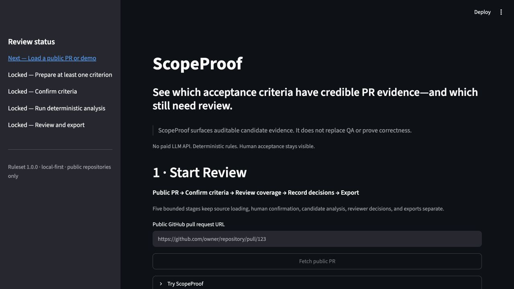
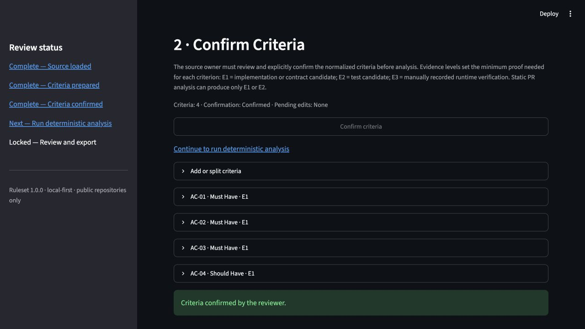
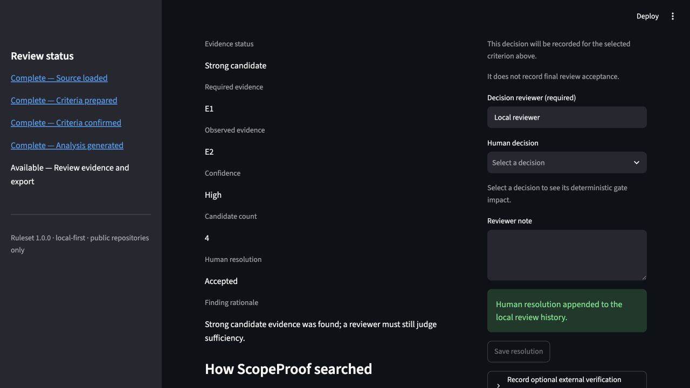
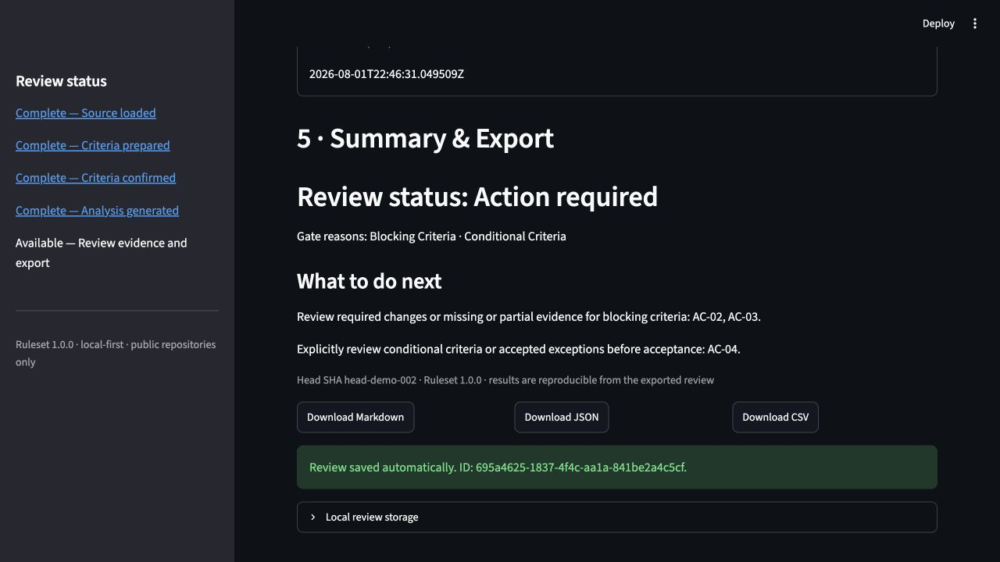
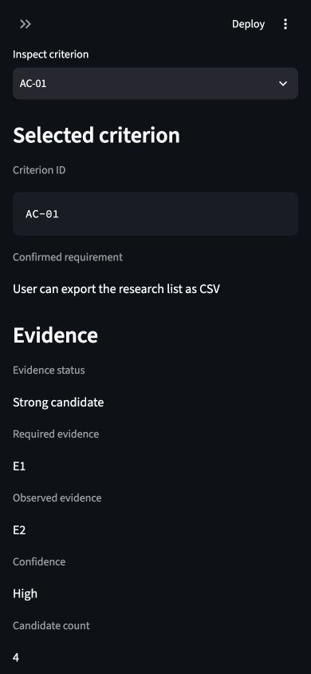

# Workbench UX simplification verification

## Scope and evidence boundary

- Date: 2026-08-01 (America/Toronto)
- Tested source commit: `1a07eb92e322326ced373288cc5afb96b8cd974d`
- Environment: macOS 26.5.1 (build 25F80), Apple silicon (`arm64`), Codex In-app Browser. The Browser surface did not expose a browser version or user-agent value.
- Local server: `uv run scopeproof-web --host 127.0.0.1 --port 8512`, using isolated temporary home `/tmp/scopeproof-task8-home.GPG9Mw`.
- Health: `GET http://127.0.0.1:8512/_stcore/health` returned `ok`.

This is current-run, owner-operated engineering evidence for a deliberately constructed demo. It does not prove customer usability, production or runtime correctness, cross-platform behavior, assistive-technology compatibility, WCAG conformance, or acceptance-criteria satisfaction. It earns **zero Stage 1 credit**.

## Automated gates

| Command | Result |
| --- | --- |
| `uv run pytest -q tests/apps/test_streamlit_app.py tests/apps/test_view_models.py tests/apps/test_web_app.py tests/test_presentation.py` | Passed: 173 tests in 98.40 seconds. |
| `uv run ruff check apps/web tests/apps` | Passed: `All checks passed!` |

These commands provide focused engineering checks. In particular, source/test definitions remain distinct from executed runtime verification of the constructed repository evidence.

## Desktop walkthrough — actual 1280×720 viewport

### 1. Start Review

- Browser measurement reported `window.innerWidth = 1280` and `window.innerHeight = 720`.
- The PR URL input and `Fetch public PR` were first in document order. Their measured tops were 577 px and 631 px.
- The four optional controls followed at measured tops 687, 743, 838, and 894 px: `Try ScopeProof`, `Alpha feedback session (optional)`, `Advanced source options`, and `Resume a saved review`.
- All four optional controls were collapsed.

### 2. Confirm Criteria

- The constructed demo prepared four criteria.
- The early `Confirm criteria` action changed the summary to `Criteria: 4 · Confirmation: Confirmed · Pending edits: None`.
- AC-01 through AC-04 remained collapsed (`details.open = false` for each criterion editor).

### 3. Evidence and ordinary decision

- Analysis produced one compact observed-CI summary: `Observed CI: Passing`, `Collection: Complete`, one successful completed check, and `Runtime verification: Not recorded`.
- AC-01 was selected. Both evidence groups were opened and inspected:
  - Implementation: `EV-AC-01-01` and `EV-AC-01-04`.
  - Test: `EV-AC-01-02` and `EV-AC-01-03`; the UI explicitly described these as test intent, not executed verification.
- The ordinary criterion decision was recorded as `Accepted` by `Local reviewer`. The local review history showed that outcome for AC-01.
- `Record optional external verification (E3/E4)` and `Recorded runtime evidence (0)` remained optional and collapsed.

### 4. Summary, exports, and automatic persistence

- Summary remained fail-closed at `Review status: Action required` with `Blocking Criteria · Conditional Criteria` after AC-01 was accepted.
- `Download Markdown`, `Download JSON`, and `Download CSV` appeared consecutively before `Local review storage` in document order.
- No manual review-save action was used. The UI reported `Review saved automatically. ID: 695a4625-1837-4f4c-aa1a-841be2a4c5cf.`
- Expanding local storage reported `Saved locally — current review matches local storage`; `Save now` was disabled. The isolated-home JSON file existed and retained `Local reviewer`, the AC-01 acceptance event, and `head-demo-002`.

## Narrow walkthrough — actual 390×844 viewport

- Browser measurement reported `window.innerWidth = 390` and `window.innerHeight = 844`.
- Page-level horizontal overflow was not observed: HTML and body each measured `clientWidth = 390` and `scrollWidth = 390`.
- In document order, `Evidence` preceded `Criterion resolution` (heading indices 9 and 12). At the evidence anchor their measured tops were 391 px and 2055 px, respectively, showing the columns had stacked evidence-first.
- Both evidence groups were opened at this width. The open groups exposed all four AC-01 evidence IDs: `EV-AC-01-01`, `EV-AC-01-04`, `EV-AC-01-02`, and `EV-AC-01-03`. The page-level width remained 390 px while they were open.
- At the summary anchor all three download buttons resolved uniquely and were visible, so the downloads remained reachable.
- This is a single macOS/browser narrow-width observation, not mobile-device, cross-platform, or accessibility-conformance evidence.

## Console, keyboard, zoom, and unavailable environments

The walkthrough tab and the separate keyboard-attempt tab each returned an empty warning/error log (`[]`) when queried after the exercised flow. Zero ScopeProof-caused console errors or warnings were observed in this run.

| Check | Result | Current-run observation |
| --- | --- | --- |
| PR URL focus and input | Confirmed | Keyboard-targeted input accepted `https://github.com/octocat/Hello-World/pull/1`; Enter applied the value and enabled Fetch. The input remained the active element during entry. |
| Fetch public PR | Not confirmed | The enabled, unique button received Enter, Space, and focused Enter attempts, but the Browser surface exposed no loading, success, or error state transition. |
| Demo expansion and load | Not confirmed | The unique `Try ScopeProof` summary could be focused by the keyboard harness, but Enter did not change `details.open` from `false`; the demo-load button therefore was not activated in a keyboard-only chain. |
| Criteria confirmation | Not confirmed | A keyboard-only demo-load state could not be established, so the enabled confirmation action was unavailable without mixing pointer setup into this check. |
| Deterministic analysis | Not confirmed | The keyboard-only chain did not reach an enabled analysis action. |
| Criterion selection | Confirmed | ArrowDown opened the four-option criterion list and ArrowDown plus Enter changed the selected criterion from AC-01 to AC-02. |
| Ordinary resolution | Not confirmed | ArrowDown plus Enter selected ordinary `Accepted`, but Enter on `Save resolution` produced no append status. Selection was exercised; persisted submission was not proven. |
| Optional external verification | Not confirmed | Enter on the focused, unique E3/E4 summary left `details.open = false`. |
| Downloads | Not confirmed | Enter was attempted on each unique enabled Markdown, JSON, and CSV download button; no download event was exposed within three seconds for any button. Reachability remains separately confirmed by the pointer/narrow checks above. |
| Actual 200% browser zoom | Not confirmed | Browser documentation and advertised capabilities exposed only `visibility` and `viewport`, with no supported zoom control or measurable 200% zoom result. Viewport resizing was not treated as zoom. |
| Screen reader | Not confirmed | No screen-reader surface was available or exercised. |
| Windows | Not confirmed | Not available in this macOS run. |
| Linux | Not confirmed | Not available in this macOS run. |

Keyboard rows report only the exact exercised interaction. They do not establish full tab order, screen-reader behavior, WCAG conformance, or general keyboard accessibility.

## Conclusion

The constructed demo completed the requested pointer flow at 1280×720 and the bounded responsive checks at 390×844. The observed flow preserved explicit confirmation, deterministic evidence boundaries, a fail-closed action-required summary, exports before local storage, and automatic durable local persistence. Keyboard and zoom limitations remain explicitly `Not confirmed`. This record is engineering evidence only and provides zero Stage 1 credit.
